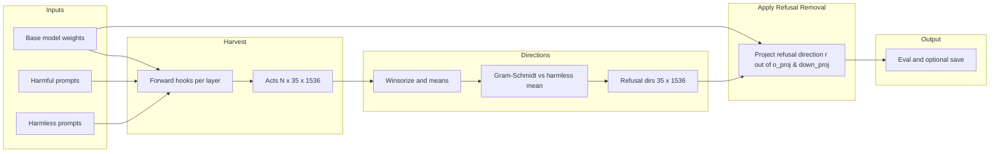

# Gemma 4 E2B Refusal Removal Scripts

This folder implements a **refusal removal** (uncensoring) pipeline: estimate a per-layer “refusal direction” from hidden states on harmful vs harmless prompts, then **project that direction out of selected weight matrices** (`o_proj`, `down_proj`) while **preserving row norms**. The target model is a locally stored **Gemma 4 E2B IT** checkpoint (`Gemma4ForConditionalGeneration`), run on **Apple Silicon (MPS)** when available.

> **Safety note:** Uncensored models can answer requests the base model refused. Use only on your own hardware, for research, and in line with your license and policy obligations.

## Credits and References

- **Primary inspiration & method:** [github.com/TrevorS/gemma-4-abliteration](https://github.com/TrevorS/gemma-4-abliteration) — Norm-preserving rank-1 refusal removal, evaluation framework, and detailed technical notes.
- **Base weights:** this repo expects a local copy of **Gemma 4 E2B IT** at `models/gemma-4-E2B-it/`. The usual upstream is [`google/gemma-4-E2B-it` on Hugging Face](https://huggingface.co/google/gemma-4-E2B-it) (gated; accept Google’s terms on HF before downloading).
- **Datasets:** harmful prompts from [`mlabonne/harmful_behaviors`](https://huggingface.co/datasets/mlabonne/harmful_behaviors); harmless prompts from [`tatsu-lab/alpaca`](https://huggingface.co/datasets/tatsu-lab/alpaca) (see `data.py` for fields used).

## Prerequisites

- **Conda environment** with PyTorch (MPS or CUDA), `transformers`, `datasets`, `tqdm` (if used), and enough RAM/VRAM for Gemma 4 E2B in float16.
- **Model on disk** at `../models/gemma-4-E2B-it/` (path is defined in `config.py` as `MODEL_PATH`).
- **Hugging Face datasets** (downloaded on first use; see [Credits and references](#credits-and-references) for links):
  - `mlabonne/harmful_behaviors` — harmful prompts (`text`).
  - `tatsu-lab/alpaca` — harmless instructions (`instruction` where `input == ""`).
- Run commands **from this directory** (`scripts/`) so imports resolve:

  ```bash
  conda activate mainenv   # or your env with the deps above
  cd scripts
  ```

## Layout

| Path | Purpose |
|------|---------|
| `cache/` | Optional PyTorch caches written by `run.py` (see below). |
| `output/` | Uncensored model + tokenizer after `run.py --save-model`. |

## End-to-end commands

| Command | What it does |
|---------|----------------|
| `python run.py` | Full pipeline: load model → baseline eval → harvest → directions → apply refusal removal in memory → post eval → extended eval. |
| `python run.py --save-model` | Same, plus save weights and tokenizer to `output/`. |
| `python run.py --skip-harvest` | If `cache/activations.pt` exists, reload activations instead of re-harvesting. If `cache/directions.pt` also exists, reload directions; otherwise recompute from activations. |
| `python run.py --skip-eval` | Skip the 50-prompt extended harmful eval (saves time). |
| `python run.py --n-harmful 100 --n-harmless 100` | Smaller harvest (useful if memory or time is tight). |
| `python test_quick.py` | Smoke test: few prompts, apply refusal removal to **one** high-quality layer, check row norms and one generation. |
| `python test_model.py -p "your question"` | Load **base** model, print reply; unload; load **saved** uncensored model from `output/`, print reply (two full loads, one at a time). |

### Cache files (`cache/`)

- **`activations.pt`** — dict with `"harmful"` and `"harmless"` tensors, shape `[N, 35, 1536]` (CPU float from harvest).
- **`directions.pt`** — dict with `"directions"` `[35, 1536]` and `"qualities"` (per-layer scores and ordering).

Deleting these files forces a fresh harvest / direction step on the next full run (unless you only change code and want to invalidate manually).

## Pipeline overview



## Module reference

### `config.py`

Central settings and helpers:

- **`DEVICE`** — `mps` if available, else `cuda`, else `cpu`.
- **`MODEL_PATH`** — `../models/gemma-4-E2B-it/`.
- **`CACHE_DIR`**, **`OUTPUT_DIR`** — `cache/`, `output/` under `scripts/`.
- **`DTYPE`** — `float16` (chosen for MPS compatibility).
- **`N_HARMFUL`**, **`N_HARMLESS`**, **`MAX_SEQ_LEN`**, **`WINSORIZE_QUANTILE`**, **`TARGET_MODULES`**, **`TEST_PROMPTS`**, **`REFUSAL_MARKERS`** — pipeline and eval defaults.
- **`get_text_layers(model)`** — returns `model.model.language_model.layers` (Gemma 4 multimodal stack: text decoder lives under `language_model`).
- **`clear_mps_cache()`** — calls `torch.mps.empty_cache()` on MPS.

Run standalone: `python config.py` prints device, paths, and shapes.

### `data.py`

- **`load_harmful_prompts(n)`** — first `n` rows from `mlabonne/harmful_behaviors`.
- **`load_harmless_prompts(n)`** — Alpaca instructions with empty `input`, first `n`.
- **`format_prompts(tokenizer, prompts)`** — wraps each prompt with `apply_chat_template(..., add_generation_prompt=True)`.

### `harvest.py`

- **`harvest_activations(model, tokenizer, formatted_prompts, device)`** — for each prompt, registers forward hooks on every text layer, runs one forward pass, collects **last-token** hidden state per layer, moves tensors to **CPU**, clears MPS cache between prompts. Returns `[n_prompts, n_layers, hidden_size]`.

Hooks treat layer output as a tensor or tuple (defensive for API differences).

### `directions.py`

- **`compute_refusal_directions(harmful_acts, harmless_acts)`** — CPU float32 work: winsorize activations, per-layer mean difference (harmful − harmless), **double-pass Gram–Schmidt** to remove the component along the harmless mean, normalize to a unit vector per layer. Returns directions `[35, 1536]` and **`layer_qualities`**, a list of `(layer_index, score)` sorted best-first (used by `test_quick.py` to pick one layer).

### `abliterate.py`

- **`modify_weight_norm_preserved(weight, refusal_dir)`** — For weight `W` with shape `[out_features, in_features]` and refusal direction `r` in **output space** `[out_features]`:

  - Compute `proj_vec = r @ W` then apply rank-1 update: `W - r.unsqueeze(1) * proj_vec.unsqueeze(0)`, applied twice for numerical stability.
  - Rescale **rows** so row norms match the original matrix (norm preservation).
  - Cast back to the weight’s dtype (e.g., float16).

- **`abliterate_model(model, refusal_directions, device)`** — For each of the 35 layers, applies the above to **`self_attn.o_proj`** and **`mlp.down_proj`** in place.

Non-square matrices (e.g., wide `down_proj` on some layers) are handled correctly via this output-space formulation.

### `evaluate.py`

- **`generate_response(...)`** — Chat template for a single user turn, `model.generate` with sampling (`temperature`, `top_p`, `top_k`), decode **new** tokens only.
- **`classify_response(response)`** — Heuristic labels: `refused`, `complied`, or `disclaimer_but_complied` using `REFUSAL_MARKERS` from `config.py`.
- **`evaluate_model(...)`** — Runs many prompts, aggregates counts and `refusal_rate`.
- **`print_report(before, after)`** — Side-by-side table and short post-refusal removal excerpts.

### `run.py`

Orchestrates: baseline eval on `TEST_PROMPTS` → harvest (or cache) → directions (or cache) → **`abliterate_model`** → post eval → optional extended eval on held-out harmful indices 200–249 → optional **`save_pretrained`** to `output/`.

**Important:** The in-memory model after a run is already uncensored (refusals removed). To compare against the original again, reload from `MODEL_PATH` (see `test_model.py`).

### `test_quick.py`

Loads the base model, runs one baseline generation, harvests 10 harmful + 10 harmless prompts, computes directions, picks the **top-quality** layer, applies refusal removal to **only that layer’s** `o_proj` and `down_proj`, checks **row-norm drift** on `o_proj`, prints a second generation. Useful for a fast sanity check; **single-layer** modification may not change refusal behavior much—that is expected.

### `test_model.py`

CLI utility:

```bash
python test_model.py -p "How are you?"
python test_model.py --prompt "How are you?" --max-new-tokens 128
```

Loads base from `MODEL_PATH`, prints **BEFORE**; then, if `output/config.json` exists, loads the saved uncensored model and prints **AFTER**. Exits with code **1** if the uncensored checkpoint is missing (after printing the base result).

## Gemma 4 specifics (why the code looks this way)

- **Layer path:** Text decoder layers are `model.model.language_model.layers[i]`, not `model.model.layers[i]`.
- **Hook output:** Decoder layers return a **tensor** of hidden states; the code still supports a tuple for robustness.
- **Widths:** `o_proj` / `down_proj` are not necessarily square; ablation uses the **output-space** direction `r` with `r @ W` and the rank-1 update described above.

## Typical workflow

1. Place the base Gemma 4 E2B IT model at `models/gemma-4-E2B-it/`.
2. `cd scripts && python config.py` — confirm device and path.
3. `python run.py --save-model` — full run + save (longest step is usually generation during eval).
4. `python test_model.py -p "…"` — compare base vs saved uncensored reply on any prompt.

## Troubleshooting

- **OOM on MPS:** Lower `--n-harmful` / `--n-harmless`, or use `--skip-eval`, or close other GPU-heavy apps.
- **`--skip-harvest` did not skip:** Requires existing `cache/activations.pt`. Directions reload additionally requires `cache/directions.pt` **and** `--skip-harvest`.
- **Disk offload message from `transformers`:** `device_map="auto"` may offload some weights to disk; runs can be slower—watch free disk space.
- **After section missing in `test_model.py`:** Run `python run.py --save-model` once so `output/` contains a full saved model.
